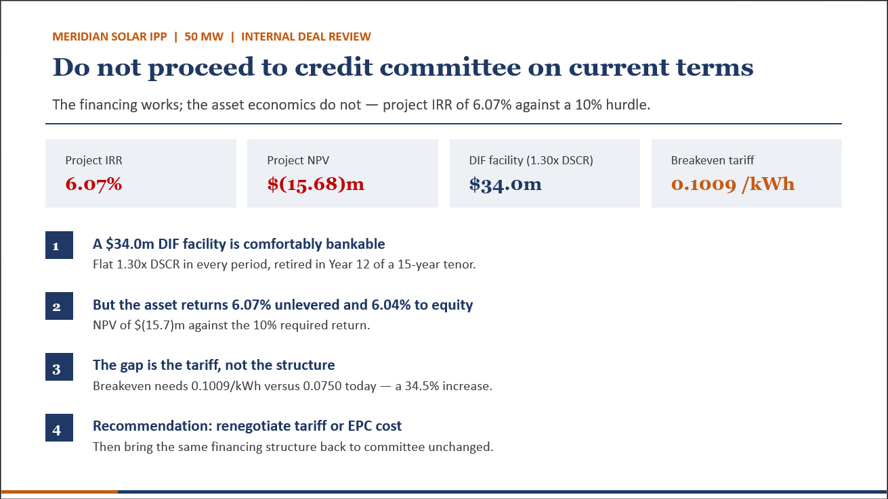
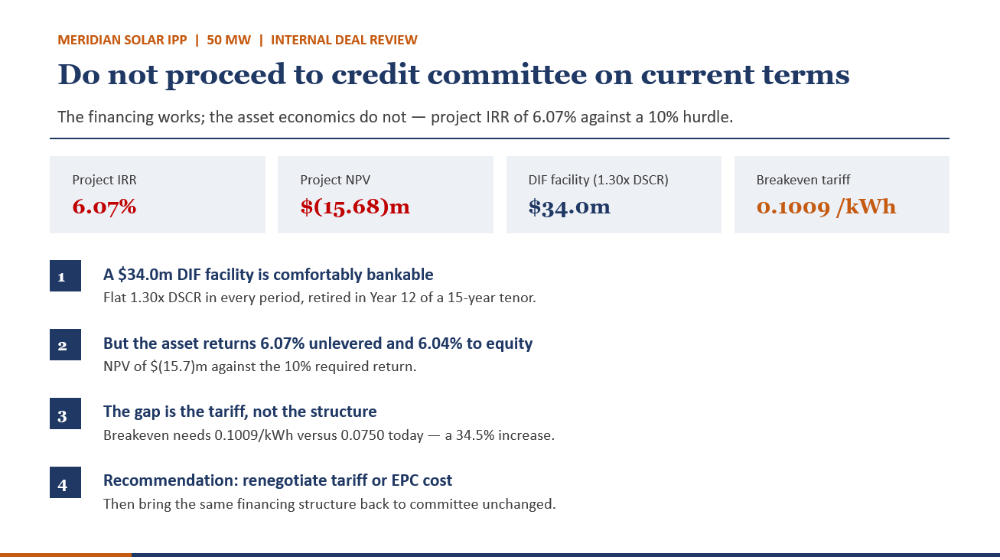
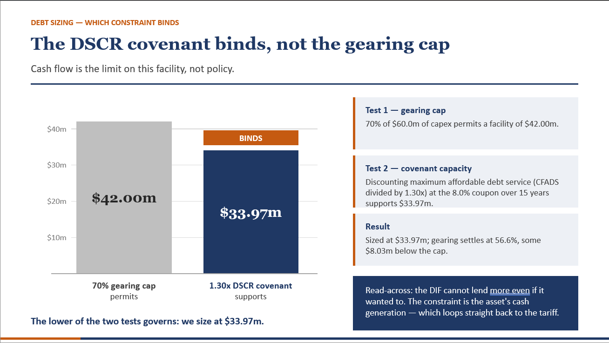

# Meridian Solar IPP — Project Finance Model & Debt Structuring

A full project finance model for a 50 MW greenfield solar independent power producer, sized against a senior debt facility and stress-tested to a recommendation. Built in Excel from a blank workbook.

The headline finding is that the project does not clear its hurdle rate: **6.07% unlevered IRR against a 10% required return, and an NPV of $(15.68)m.** The financing structure works. The asset economics do not, and the gap is the tariff.

> **Note on data.** Meridian Solar IPP, the Domestic Infrastructure Fund and all associated figures are illustrative and constructed for this case study. This is not a live mandate and does not represent any real project, fund or transaction. Any resemblance to an actual entity is coincidental.

---

## Contents

| File | What it is |
| --- | --- |
| `Meridian_Solar_IPP_Model.xlsx` | The model — assumptions, cash flow build, debt schedule, sensitivities, outputs |
| `Meridian_Solar_IPP_Deal_Review.pdf` | 12-slide deal review presentation |
| `Meridian_Solar_IPP_Deal_Review.pptx` | The same deck in editable form |
| `RESEARCH_BRIEF.md` | Written brief supporting the technical and market assumptions |
| `Meridian_Solar_IPP_Research_Brief.pdf` | The same brief as a PDF |
| `/images` | Slide exports used below |

---

## The case

A sponsor is developing a 50 MW solar IPP and needs a project finance model to underpin funding discussions with a government-anchored infrastructure lender.

| Assumption | Value |
| --- | --- |
| Installed capacity | 50 MW |
| Total construction cost | USD 60.0m, incurred evenly over a 12-month build |
| Commercial operation date | 1 January 2027 |
| Net capacity factor | 21% |
| PPA tariff | USD 0.075/kWh, 20-year take-or-pay |
| Tariff escalation | 1.5% per year from Year 2 |
| Operating cost | USD 1.2m in Year 1, escalating 3.0% per year |
| Depreciation | 20-year straight line |
| Corporate tax | 30%, paid in the year incurred |
| Discount rate | 10% |

Lender terms: maximum gearing 70% of project cost, tenor up to 15 years from COD, 8.0% coupon, minimum DSCR covenant of 1.30x in every period, six-month debt service reserve funded at COD, and a 50% cash sweep of surplus after DSCR is met.

---

## Model architecture

Five tabs, structured so the debt assumptions switch on without rebuilding the operating model.

**Assumptions** — every input on one page, colour-coded and referenced absolutely. No number is hard-coded inside a formula anywhere in the workbook.

**Model** — annual periods from construction through the 20-year operating life. Revenue build (generation → tariff → revenue), operating cost build, depreciation and tax schedule, and a clean CFADS line computed on an unlevered basis so debt service draws from it without circularity.

**Debt** — facility sizing tested against both binding constraints, sculpted amortisation, period-by-period drawdown, interest, principal, closing balance and DSCR.

**Sensitivities** — a 7×7 grid of net capacity factor against PPA tariff, plus single-variable breakevens on tariff, capacity factor and capex.

**Outputs** — returns, coverage and breakeven summary feeding the deck.

### Built-in checks

The model validates itself rather than relying on the reader to spot an error:

- NPV computed two ways — summed discounted cash flows against the `NPV()` function — and flagged if the two disagree by more than 0.001
- Taxable profit flagged in any period where it turns negative, since no loss carry-forward is modelled
- Breakeven tariff fed back through the cash flow to confirm it reproduces an NPV of exactly zero
- Sources and uses tied to total project cost

Change any input on the Assumptions tab and the workbook recalculates cleanly.

---

## Findings

### 1. The project does not clear its hurdle

| Metric | Base case |
| --- | --- |
| Project (unlevered) IRR | 6.07% |
| NPV at 10% | USD (15.68)m |
| Simple payback from COD | 12 years |
| Undiscounted cash-on-cash | 1.78x |
| Lifetime generation | 1,839.6 GWh |
| Average annual CFADS | USD 5.35m |

Year 1 EBITDA margin reaches 82.6% — solar has no fuel cost — but the asset is capital-heavy and the contracted tariff sits below its levelised cost of production.

### 2. The breakeven tariff is the LCOE at a 10% cost of capital

| Lever | Base | Breakeven | Change required |
| --- | --- | --- | --- |
| PPA tariff | 0.0750 /kWh | 0.1009 /kWh | +34.5% |
| Net capacity factor | 21.0% | 28.2% | +7.2pp |
| Total capex | USD 60.0m | USD 42.03m | −30.0% |

The tariff at which NPV equals zero *is* the project's levelised cost of energy at that discount rate. The offered tariff is 34.5% below it. This is not a marginal shortfall — the contract price is materially under the cost of production.

### 3. The conclusion is robust across the sensitivity range

Across the 7×7 grid of capacity factor against tariff, project IRR spans 0.9% to 11.2%. **Only 3 of 49 scenarios clear a 10% return**, and every one requires a capacity factor of 24.0% or better *and* a tariff of 0.0850 or better — simultaneous outperformance on two independent variables. The failure is not an artefact of the central case.

### 4. The DSCR covenant binds, not the gearing cap

| Test | Permits |
| --- | --- |
| 70% gearing cap on USD 60.0m of capex | USD 42.00m |
| 1.30x DSCR covenant against project CFADS | **USD 33.97m** ← binds |

Sized at USD 33.97m, gearing settles at 56.6% — some USD 8.03m below the cap. The lender could not deploy more even if policy allowed. The constraint is the asset's cash generation, which loops back to the tariff.

**Sources and uses**

| Sources | USD m | Uses | USD m |
| --- | --- | --- | --- |
| Senior debt | 33.97 | Construction capex | 60.00 |
| Sponsor equity | 27.91 | Debt service reserve | 1.88 |
| **Total** | **61.88** | **Total** | **61.88** |

The DSRA is treated as equity-funded and outside the gearing base — the conservative reading, stated on the assumptions tab rather than buried.

### 5. Leverage is not the problem

| Metric | Value |
| --- | --- |
| Minimum DSCR | 1.30x |
| Average DSCR | 1.30x |
| DSCR including 50% cash sweep | 1.13x |
| Facility repaid | Year 12 of a 15-year tenor |
| Equity IRR | 6.04% |

The naive read is that an 8.0% coupon against a 6.07% asset return must destroy equity value. It doesn't: interest is deductible, and the shield is worth USD 6.15m over the life against USD 20.50m of interest paid. After tax the facility costs an effective **5.60%**, below the 6.07% the asset earns. The capital structure is efficient. Both returns are simply too low.

### 6. The structure has zero headroom by construction

Sculpting to exactly 1.30x means any CFADS miss breaches on day one. The recommendation is to resculpt at 1.40–1.45x and accept a smaller facility.

---

## Recommendation

**Do not proceed on current terms.** Seek a mandate to renegotiate the tariff toward 0.1009/kWh — or a blended package of tariff plus capital contribution reaching the same NPV — commission an independent P50/P90 yield study with debt sized off P90, and re-tender the EPC scope to test whether the 30% capex saving is achievable. Hold the financing structure unchanged; it is ready to execute the moment the economics clear.

**Two risks to mitigate before financial close.** First, offtaker credit: all debt service rests on one counterparty and the structure carries no headroom, so a payment delay is an immediate breach. Second, resource and capex: the 21% capacity factor is a single point estimate with no degradation allowance, and a USD 5m overrun costs roughly 0.8pp of IRR.

---

## Stated limitations

Both of these flatter the result and both are disclosed rather than buried:

- **No panel degradation is modelled.** Crystalline silicon typically degrades 0.4–0.5% per year, compounding to roughly 8–9% of lost output by Year 20. Late-life CFADS is therefore overstated. Because debt is sized off early-year cash flow the effect on debt capacity is modest, but it would not survive a lender's technical adviser.
- **No inverter replacement or maintenance capex.** Inverters typically need replacing around Years 10–12. In a live transaction this would be a funded reserve and a genuine drag on distributions in the second half of the PPA.

Two further judgements, made where the case is silent and stated on the assumptions tab: tax is computed on an unlevered basis so CFADS is clean and pre-financing, with the interest shield credited separately to equity; and no loss carry-forward mechanic is modelled because no taxable loss arises in the base case.

---

## Tools

Microsoft Excel — no add-ins, no macros, no external links.

---

## Author

Rosemary Waweru — Financial Analyst
[LinkedIn](https://www.linkedin.com/in/rosemary-waweru-85108b2a1) · [GitHub](https://github.com/ShikohWaweru)
